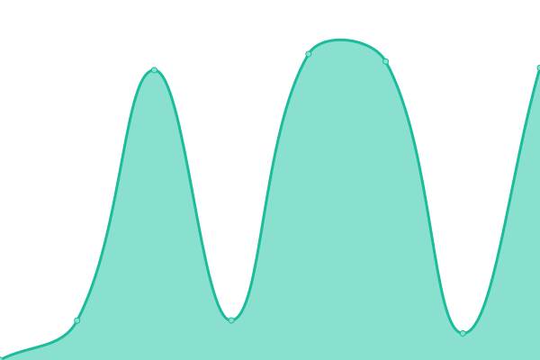
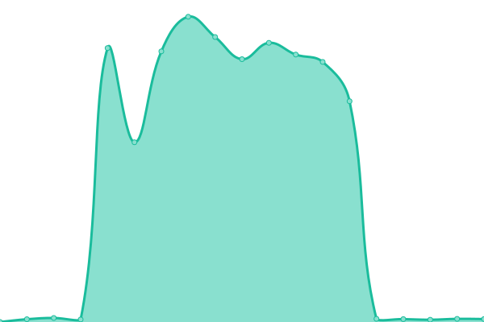
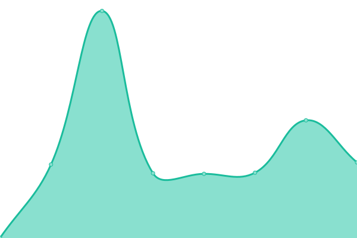

# 🌐 Monitoramento de Serviços

Este repositório contém o monitoramento de uptime dos nossos serviços, utilizando o [Upptime](https://upptime.js.org), uma ferramenta de código aberto baseada em GitHub Actions, Issues e Pages.

## 📊 Status Atual

A cada 5 minutos, realizamos verificações automáticas nos serviços definidos. Os dados são atualizados neste repositório com informações como:

- Disponibilidade (Online / Offline)
- Tempo de resposta
- Histórico de incidentes

## 🚦 Painel de Status

Você pode acessar o painel de status completo aqui:

👉 **[status.bendevoficial.com](https://status.bendevoficial.com)**

## 📈 Uptime e Resposta

<!--start: status pages-->
<!-- This summary is generated by Upptime (https://github.com/upptime/upptime) -->
<!-- Do not edit this manually, your changes will be overwritten -->
<!-- prettier-ignore -->
| URL | Status | History | Response Time | Uptime |
| --- | ------ | ------- | ------------- | ------ |
|  [matogrossototal.com](https://matogrossototal.com) | 🟩 Up | [matogrossototal-com.yml](https://github.com/bendevjunior/status/commits/HEAD/history/matogrossototal-com.yml) | 

 1757ms
     
 | 

<a href="https://status.bendevoficial.com/history/matogrossototal-com">100.00%</a>
    

|  [pedidomesa.com](https://pedidomesa.com) | 🟩 Up | [pedidomesa-com.yml](https://github.com/bendevjunior/status/commits/HEAD/history/pedidomesa-com.yml) | 

 425ms
     
 | 

<a href="https://status.bendevoficial.com/history/pedidomesa-com">100.00%</a>
    

|  [portalmichalak.com.br](https://portalmichalak.com.br) | 🟩 Up | [portalmichalak-com-br.yml](https://github.com/bendevjunior/status/commits/HEAD/history/portalmichalak-com-br.yml) | 

 1669ms
     
 | 

<a href="https://status.bendevoficial.com/history/portalmichalak-com-br">100.00%</a>
    

<!--end: status pages-->

## 🔧 Automatizações

Este projeto conta com os seguintes workflows automatizados via GitHub Actions:

- **Uptime CI**: Verificação da disponibilidade dos serviços.
- **Response Time CI**: Mede o tempo de resposta.
- **Graphs CI**: Gera gráficos históricos.
- **Static Site CI**: Atualiza o site de status.
- **Summary CI**: Atualiza o resumo geral no `README.md`.

## ⚙️ Sobre o Projeto

Este monitor foi construído com [Upptime](https://github.com/upptime/upptime), um projeto mantido pela comunidade e amplamente usado para monitoramento gratuito baseado em GitHub.

---
